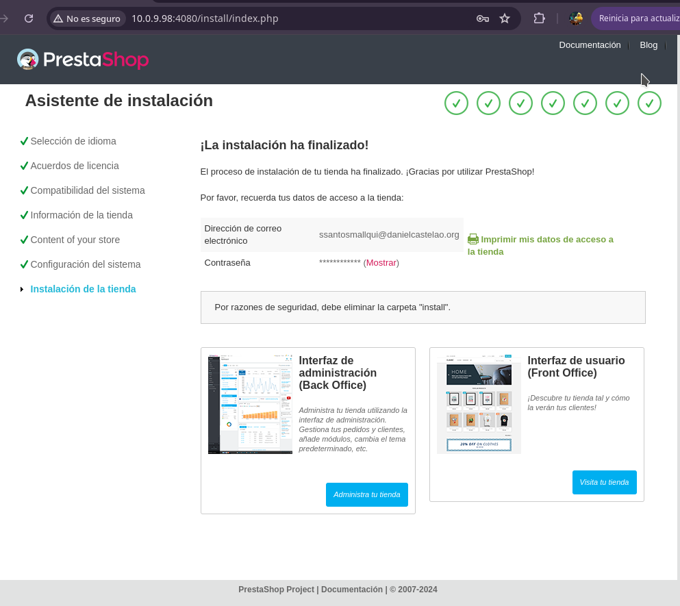

# Tarea-06---SXE

## Utiliza docker para poner en marcha Prestashop

### Creamos nuestro docker compose

Vamos a crear nuestro docker compose. Creamos el fichero "docker-compose.yml" para ello nos ubicamos en el directorio donde queremos guardarlo y con el siguiente comando lo creamos:

``touch docker-compose.yml``

Editamos el docekr compose donde insertamos las imagenes de la base de datos y la imagen de prestashop.

``nano /home/Compose/docker-compose.yml``

Ahora vamos a lanzar nuestro docker compose, para ello debemos asegurarnos de estar en el directorio donde esta creado nuestro fichero "docker-compose.yml", ponemos los siguientes comando:

``docker-compose up -d``

Esto va a crear contenedores donde se encuentren las imagenes que se especificaron en el docker-compose y los va a ejecutar. 

Luego de tener ejecutado los contenedores, vamos a ir al navegador y poner el host con el puerto que hemos especificado en el docker compose  http://10.0.9.98:4080  y si todo ah esatdo correcto se visualiza la pagina del Prestahop

### Comprobamos la ejecución en el navegador

Para la instalacion del Prestashop vamos a seguir los pasos que te den en la pagina.

> [!IMPORTANT]
> Al configurar la conexión con la base de datos, debe ser exactamente como se escribió en el docker compose. de no ser asi dará error.

Una vez finalizado todo los pasos, se descargará PrestaShop lanzando un mensaje de finalización.

Y eso sería toda la instalación de PrestaShop desde un docker compose.
